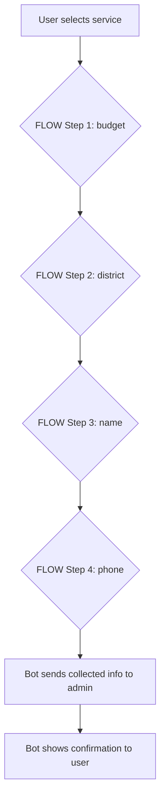

# Badges

[](https://github.com/OrithmicSoftware/your-italian-home-bot/actions/workflows/lint.yml)
[](https://github.com/OrithmicSoftware/your-italian-home-bot/actions/workflows/test.yml)

# Telegram Communication Agent

Generic, configurable Telegram communication agent bot template.

## Features


## Step Flow Guide



The bot uses a fully data-driven step flow, defined in the `FLOW` array in `config.js` (see also `config.example.js`). Each step collects a piece of information from the user, and the prompts and order are fully configurable.

**Example FLOW (from config.example.js):**

```
FLOW: [
	{ field: 'budget', prompt: 'Please enter your budget:' },
	{ field: 'district', prompt: 'Please enter your preferred district:' },
	{ field: 'name', prompt: 'Please enter your name:' },
	{ field: 'phone', prompt: 'Please enter your phone number:' },
]
```

**How it works:**
1. User selects a service from the menu.
2. The bot asks each prompt in order, saving the user's answer for each field.
3. After the last step, the bot sends the collected info to the admin and shows a confirmation message to the user.

**To customize the flow:**
- Edit the `FLOW` array in `config.js` to add, remove, or reorder steps.
- Change the `prompt` text to localize or clarify questions.
- Add new fields as needed for your use case.

**Example user journey:**
1. User: Selects "Pizza Delivery"
2. Bot: "Please enter your budget:"
3. User: "20 EUR"
4. Bot: "Please enter your preferred district:"
5. User: "Downtown"
6. Bot: "Please enter your name:"
7. User: "Alex"
8. Bot: "Please enter your phone number:"
9. User: "1234567890"
10. Bot: "Thank you! Your request has been sent to the admin."
- Data-driven, step-by-step service selection
- Collects user info (service, budget, district, name, phone, etc.)
- Sends leads/messages to admin and agent
- All strings, prompts, and flow are configurable in `config.js`
- English, safe example config for onboarding


## Setup
1. Clone the repo
2. Copy `.env.example` to `.env` and fill in your tokens
3. Copy `config.example.js` to `config.js` and customize all fields as needed (see comments in the file)
4. Run `npm install`
5. Start with `npm start`

## Configuration & Environment Variables

Copy `.env.example` to `.env` and fill in your values:

```
BOT_TOKEN=your_bot_token_here
ADMIN_CHAT_ID=your_admin_chat_id
AGENT_CHAT_ID=your_agent_chat_id
FORWARD_TO_AGENT=ask
```

- `BOT_TOKEN`: Telegram bot token
- `ADMIN_CHAT_ID`: Telegram chat ID for admin notifications
- `AGENT_CHAT_ID`: Telegram chat ID for agent forwarding
- `FORWARD_TO_AGENT`: 'no', 'all', or 'ask' (see .env.example for details)

### Centralized Strings & UI
All user/admin-facing strings, menu labels, and step flow are in `config.js`.
- To localize or update UI text, edit `config.js`.
- Do not hardcode strings in `bot.js`.
- See `config.example.js` for a safe, English, unrelated onboarding example.

### Services Structure
Services are defined as an object in `config.js`:

```
SERVICES: {
	pizza: '🍕 Pizza Delivery',
	car: '🚗 Car Rental',
	...
}
```

### Pre-commit Hooks
Lint and test run automatically before every commit using Husky:
- To set up: `npm install --save-dev husky` (already included)
- Hooks are in `.husky/pre-commit`

### Sensitive Data
- Never commit `.env` or `config.js` with real secrets.
- Both are in `.gitignore` by default.

## License
MIT